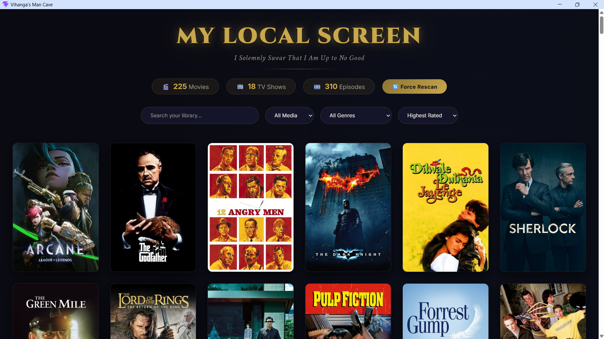
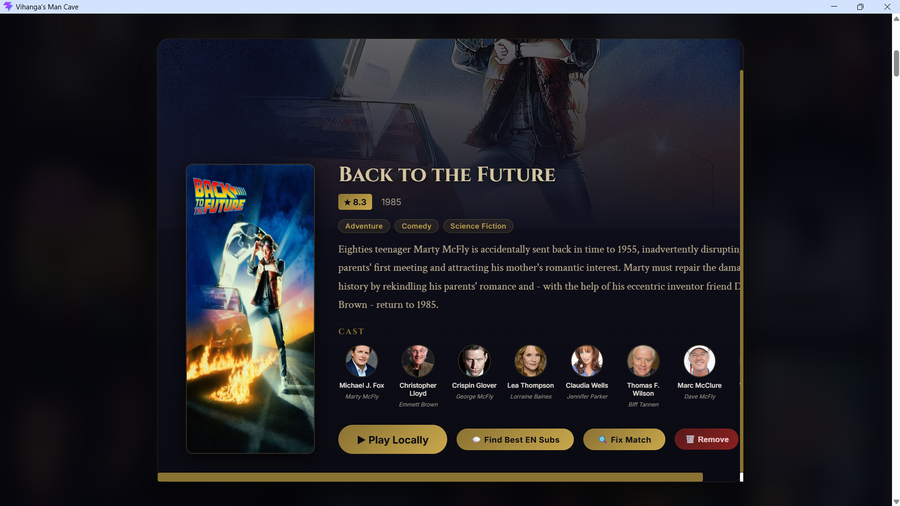

<div align="center">

# 🎬 Local Media Library

*I Solemnly Swear That I Am Up to No Good*

[](https://opensource.org/licenses/MIT)
[](https://vitejs.dev/)
[](https://reactjs.org/)
[](https://socket.io)

**A magical, beautifully automated, offline-first dashboard for your personal movie and TV show collection.**

</div>

---

## 🌟 Features

- **🪄 Zero-Config TMDB Magic:** Drop in any creatively-named video file, and the engine instantly cleans the title to fetch stunning high-res backdrops, posters, ratings, and cast information.
- **💬 Auto-Subtitle Engine:** Employs an integrated backend python script (`subliminal`) to search 5+ databases simultaneously and flawlessly place precise `.en.srt` English subtitles directly next to your movie file with a single click.
- **🖥️ True Desktop App Feel:** Completely automated dual-server loading designed to run instantly out-of-sight and pop up as an isolated native Windows application using Edge/Chrome App Mode.
- **🔥 Live Sync:** Custom WebSocket infrastructure detects new downloads in real-time. New movies instantly appear on your dashboard without needing to refresh.
- **🗃️ Smart Series Grouping:** Automatically clusters TV episodes by Season and intelligently organizes your dashboard to keep things pristine.
- **🧠 Auto-Healing Cache:** Can work 100% offline. If metadata fails to fetch due to an internet drop, the engine silently auto-repairs the missing details the precise second your connection returns!

## 📸 Screenshots

> **Note:** To add your own screenshots, just save them as `dashboard.png` and `details.png` inside the `docs/` folder, and they will automatically appear perfectly sized below!


<br/>


## 🚀 Quick Start (Windows)

1. **Clone the repo:**
   ```bash
   git clone https://github.com/dazai2003/local-media-library.git
   ```
2. **Install Dependencies:**
   - In `/backend`: run `npm install`
   - In `/frontend`: run `npm install`
3. **Configure Environment:**
   Create a `.env` file in the `/backend` folder:
   ```env
   TMDB_API_KEY=your_tmdb_api_key_here
   MEDIA_PATH=C:/path/to/your/movies/folder
   PORT=5000
   ```
4. **Launch Application:**
   Just double-click the customized desktop shortcut mapped to `Launch_Library.ps1` or run `Start_Media_Library.bat`. The UI will boot instantly into App Mode and power off securely when closed!

---
<div align="center">
  <i>Developed specifically for a premium offline viewing experience.</i>
</div>